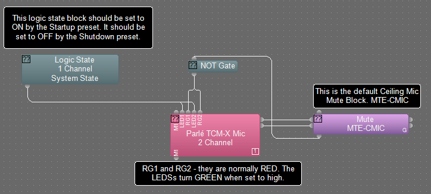

## Control Method
It is recommended to use Ethernet and Telnet to control a Biamp device.

## IP Address
Programming's default IP that will be used if none are provided is 192.168.1.141

## Serial Baud Rate
If serial control is to be used, please change the serial baud rate to 38400. This is default on the Audia.
It is NOT default on the Tesira. This lower baud rate will ensure that longer cable lengths can be used.

## Presets
* Startup
  - recalled when system is turned on
* Shutdown
  - recalled when system is turned off

## Instance Tags
| Instance Tag | Block Type | Description |
|-|-|-|
| LVM-PGM | Level Control | Program Volume, ganged if stereo|
| LVM-ATC | Level Control | VoIP or POTS Incoming Volume |
| LVM-VTC | Level Control | Video Conference Incoming Volume |
| LVM-WRLS | Level Control | Wireless Microphone Volume, multi-channel if needed |
| LVM-LECT | Level Control | Lectern Microphone Volume
| MTE-CMIC | Mute Control | Mute Ceiling Microphones
| MTE-PRV | Mute Control | Privacy Mute - Outgoing Audio to either VoIP or POTS |

## Microphone LEDs
It is recommended that the microphones' LEDs be controlled and synced with the DSP. Use the Logic output of the mute block to control the microphone's LEDs
See below on how to control LEDs of microphones.

## Parlé Microphones
Biamp Parle microphones are normally RED. When the RD1 or RD2 logic is set to high, then it will be GREEN.
Here's a sample on how to setup your Tesira file. 

## Shure MXA LEDs