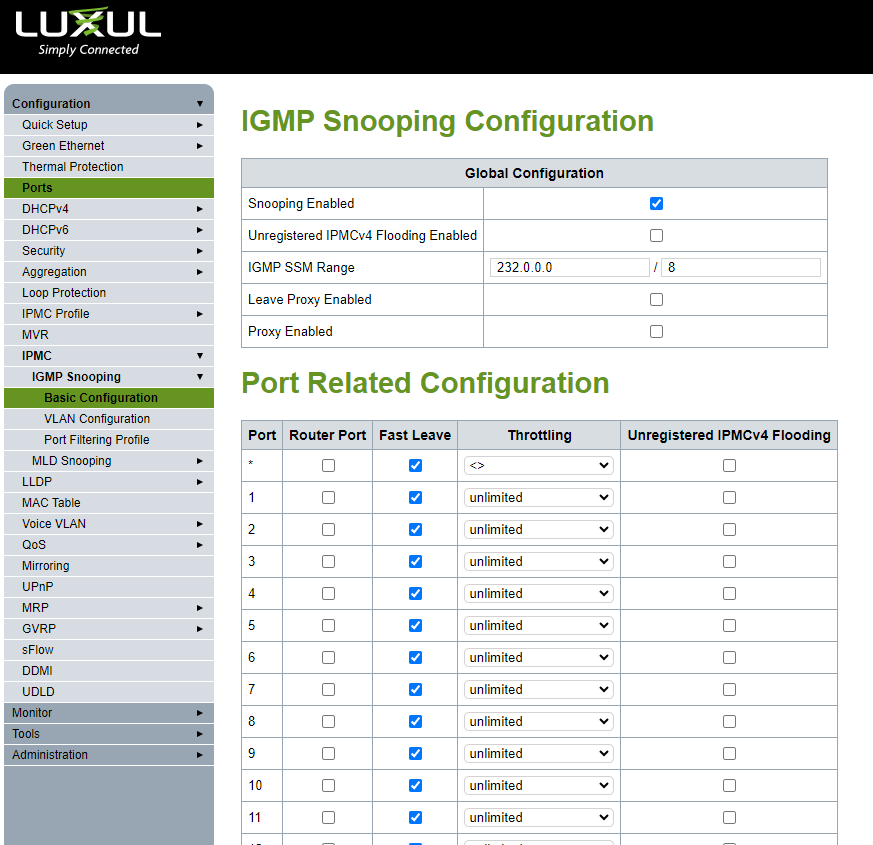

# Switch Configuration for NVX
Configuration
- IPMC
    - IGMP Snooping
        - Basic Configuration
            1) Enable Snooping
            2) Disable Unregistered IPMCv4 Flooding
            3) Enable Fast Leave for all ports
        ### 
        - VLAN Configuration
            1) Set Querier Election - this means that this switch can be the IGMP Querier.
            2) Set Compatibility to Forced IGMPv2
            3) Set Snooping Enabled
        ### 