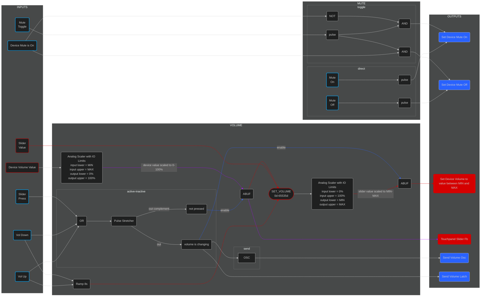

Crestron Devices often use -800d to 240d to control their volume.
Use the following logic to set the device volume as well as give feedback to the touch panel.

```mermaid
%%{init:{"theme":"dark","curve":"linear","rightAngles":true}}%%
flowchart LR
 subgraph INPUTS["INPUTS"]
        DM("Device Mute is On")
        MT("Mute<br>Toggle")
        BU("Vol Up")
        BD("Vol Down")
        SP("Slider<br>Press")
        DV("Device Volume Value")
        SV("Slider<br>Value")
  end
 subgraph OUTPUTS["OUTPUTS"]
        DMO("Set Device Mute On")
        DMF("Set Device Mute Off")
        SDV("Set Device Volume to value between MIN and MAX")
        TPFB("Touchpanel Slider Fb")
        SENDOSC("Send Volume Osc")
        SENDLATCH("Send Volume Latch")
  end
 subgraph direct["direct"]
        P1("pulse")
        MO("Mute<br>On")
        P2("pulse")
        MF("Mute<br>Off")

  end
 subgraph toggle["toggle"]
        DMN("NOT")
        P3("pulse")
        MTO("AND")
        MTF("AND")
  end
 subgraph MUTE["MUTE"]
        direct
        toggle
  end
 subgraph VOLUME["VOLUME"]
    subgraph active-inactive
        SPC("not pressed")
        SPS("Pulse Stretcher")
        OR("OR")
        SPE("volume is changing")
    end

    RAMP("Ramp 8s")
    SET_VOLUME(["SET_VOLUME<br>0d-65535d"])
    ABdevFb("ABUF")
    TAS("Analog Scaler with IO Limits<br>input lower = 0%<br>input upper = 100%<br>output lower = MIN<br>output upper = MAX")
    DAS("Analog Scaler with IO Limits<br>input lower = MIN<br>input upper = MAX<br>output lower = 0%<br>output upper = 100%")
    ABtpSet("ABUF")
    subgraph send
        SPE --> OSC --> SENDOSC
        SPE --> SENDLATCH
    end
  end
    MO --> P1
    MF --> P2
    P1 --> DMO
    P2 --> DMF
    DM --> DMN & MTF
    MT --> P3
    P3 --> MTO & MTF
    DMN --> MTO
    MTO --> DMO
    MTF --> DMF
    BU --> OR & RAMP
    BD --> OR & RAMP
    SP --> OR
    OR --> SPS
    RAMP --> SET_VOLUME
    SPS -- out --> SPE
    SPS -- out complement --> SPC
    SPC -- enable --> ABdevFb
    SV --> SET_VOLUME
    ABdevFb --> TPFB & SET_VOLUME
    SET_VOLUME --> TAS
    DAS -- device value scaled to 0-100% --> ABdevFb
    DV --> DAS
    TAS -- slider value scaled to MIN-MAX --> ABtpSet
    ABtpSet --> SDV
    SPE -- enable --> ABtpSet
    style DM stroke:#00AAFF, stroke-width:2px
    style MT stroke:#00AAFF, stroke-width:2px
    style BU stroke:#00AAFF, stroke-width:2px
    style BD stroke:#00AAFF, stroke-width:2px
    style SP stroke:#00AAFF, stroke-width:2px
    style DV stroke:#AA0000, stroke-width:2px
    style SV stroke:#AA0000, stroke-width:2px
    style DMO fill:#2962FF
    style DMF fill:#2962FF
    style SDV stroke-width:4px,stroke-dasharray: 0,stroke:#D50000,fill:#D50000
    style TPFB stroke:#D50000, stroke-width:2px,stroke-width:4px,stroke-dasharray: 0,fill:#D50000
    style SENDOSC fill:#2962FF
    style SENDLATCH fill:#2962FF
    style MO stroke:#00AAFF, stroke-width:2px
    style MF stroke:#00AAFF, stroke-width:2px
    style SET_VOLUME stroke:#D50000
    linkStyle 21 stroke:#D50000,fill:none
    linkStyle 24 stroke:#2962FF,fill:none
    linkStyle 25 stroke:#D50000,fill:none
    linkStyle 26 stroke:#AA00FF,fill:none
    linkStyle 27 stroke:#D50000,fill:none
    linkStyle 29 stroke:#AA00FF,fill:none
    linkStyle 31 stroke:#D50000
    linkStyle 32 stroke:#D50000,fill:none
    linkStyle 33 stroke:#2962FF,fill:none
```