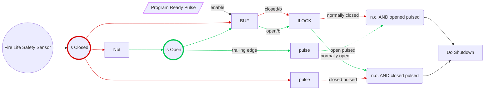

## Fire Life Safety Logic
When systems are being programmed it is usually not specified if the Fire System is Normally Open or Normally Closed. Thus it becomes a punch item during commissioning. To avoid that I use the following logic or algorithm.

When the processor boots up, assume that the fire system is not in alarm. Thus the opposite of the sensor input on the processor is the alarm state.

A Crestron implementation:
