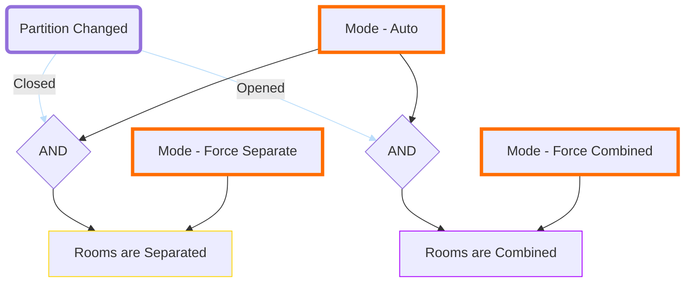

# Room Combine 
This is how to effectively program for a Combinable Room's Combine State. Sometimes partition sensors fail, go offline, or incorrectly report their state. It is then essential to let users be able to change the state of the room combination.
To achieve this, I recommend 3 buttons on the panel that determines the combine state of the room. 

A variable call it MODE which will have 3 values:
* AUTO
  - will use the partition's sensor state to determine the Combine State
* FORCE SEPARATE
  - will set the Combine State as SEPARATED
* FORCE COMBINE
  - will set the Combine State as COMBINED

